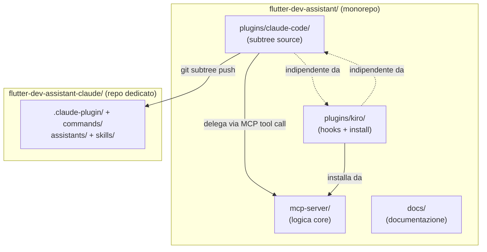
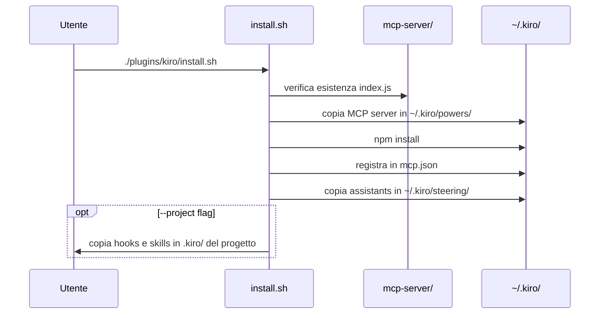
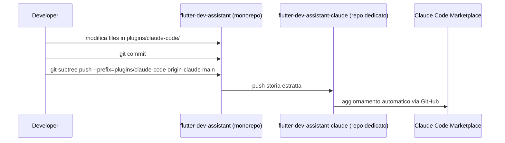

# Design Tecnico: Refactoring Architetturale Modulare

## Overview

Il progetto `flutter-dev-assistant` attualmente mescola alla root tre responsabilità distinte: la logica core del MCP server (già in `mcp-server/`), i file specifici del plugin Claude Code (`commands/`, `assistants/`, `.claude-plugin/`) e i file specifici del plugin Kiro (`hooks/`, `skills/`, `steering/`, `install-kiro.sh`). Questo refactoring separa nettamente i tre componenti in directory dedicate, eliminando la duplicazione e rendendo ogni componente distribuibile indipendentemente.

La struttura target è:

```
flutter-dev-assistant/           # monorepo (fonte di verità)
├── mcp-server/                  # Invariato — logica core standalone
├── plugins/
│   ├── claude-code/             # subtree source → repo dedicato
│   │   ├── .claude-plugin/
│   │   ├── commands/
│   │   ├── assistants/
│   │   └── skills/              # copia delle skills markdown (non link a mcp-server)
│   └── kiro/                    # Plugin Kiro IDE
│       ├── hooks/
│       ├── skills/
│       ├── steering/
│       └── install.sh
└── docs/                        # Documentazione condivisa (aggiornata)
```

Il repository dedicato `andreimbro/flutter-dev-assistant-claude` viene popolato tramite `git subtree push` e ha questa struttura standalone:

```
flutter-dev-assistant-claude/    # repo dedicato (pubblicato sul marketplace)
├── .claude-plugin/
│   └── plugin.json              # path SOLO relativi alla propria root
├── commands/
├── assistants/
└── skills/                      # stesse skills, sincronizzate via subtree
```

---

## Architecture

### Principio di separazione

Il design segue il principio **"logica nel server, presentazione nel plugin"**:

- `mcp-server/` è l'unica fonte di verità per la logica Flutter. Non dipende da nulla fuori dalla propria directory.
- `plugins/claude-code/` contiene solo file di presentazione (markdown per comandi e assistants) e configurazione. I comandi delegano al MCP server via tool call invece di reimplementare la logica.
- `plugins/kiro/` contiene hook, skills, steering files e lo script di installazione. L'installazione punta al `mcp-server/` nella Plugin_Root.



### Flusso di installazione



---

## Components and Interfaces

### 1. MCP Server (`mcp-server/`)

Nessuna modifica strutturale. Il server rimane autonomo con il proprio `package.json`. Espone 6 tool MCP:

| Tool | Descrizione |
|------|-------------|
| `flutter-verify` | Verifica qualità codice |
| `flutter-security` | Audit sicurezza OWASP |
| `flutter-plan` | Generazione piani implementativi |
| `flutter-checkpoint` | Snapshot di progresso |
| `flutter-orchestrate` | Coordinamento multi-assistants |
| `flutter-learn` | Estrazione pattern |

Il server carica i propri file interni (assistants JSON, commands JSON, skills JSON) con path relativi a `mcp-server/` — già corretto nell'implementazione attuale.

### 2. Plugin Claude Code (`plugins/claude-code/`)

```
plugins/claude-code/             # subtree source nel monorepo
├── .claude-plugin/
│   └── plugin.json              # path standalone (nessun ../../)
├── commands/                    # 8 file .md (spostati da commands/)
│   ├── flutter-verify.md
│   ├── flutter-plan.md
│   ├── flutter-checkpoint.md
│   ├── flutter-orchestrate.md
│   ├── flutter-learn.md
│   ├── flutter-security.md
│   ├── flutter-init.md
│   └── flutter-help.md
├── assistants/                  # 11 file .md (spostati da assistants/)
│   └── *.md
└── skills/                      # 23 file .md (copia da skills/ root)
    └── *.md
```

Il `plugin.json` usa path relativi alla propria root — compatibili sia nel monorepo (via subtree) che nel repo dedicato:
- `"commands": ["commands/"]`
- `"agents": ["assistants/flutter-architect.md", ...]`
- `"skills": ["skills/"]`

Le skills markdown in `plugins/claude-code/skills/` sono una copia delle skills usate da Claude Code. Sono distinte dalle skills JSON in `mcp-server/skills/` (usate dal MCP server). Quando le skills vengono aggiornate nel monorepo, il `git subtree push` le sincronizza automaticamente nel repo dedicato.

I comandi markdown che invocano operazioni disponibili nel MCP server includono una sezione che delega via tool call MCP, evitando la reimplementazione della logica.

### 3. Plugin Kiro (`plugins/kiro/`)

```
plugins/kiro/
├── install.sh               # Spostato e aggiornato da install-kiro.sh
├── hooks/                   # 8 file .kiro.hook (spostati da hooks/)
│   ├── hooks.json
│   └── *.kiro.hook
├── skills/                  # 23 file .md (spostati da skills/)
│   └── *.md
└── steering/                # 7 file .md (spostati da steering/)
    └── *.md
```

Lo script `install.sh` aggiorna i path relativi per puntare a `../../mcp-server/` dalla propria posizione in `plugins/kiro/`.

---

## Data Models

### plugin.json (Claude Code) — struttura standalone

```json
{
  "name": "flutter-dev-assistant",
  "version": "1.1.0",
  "agents": [
    "assistants/flutter-architect.md",
    "assistants/flutter-tdd-guide.md"
  ],
  "skills": ["skills/"],
  "commands": ["commands/"]
}
```

Tutti i path sono relativi alla root del repo dedicato — nessun `../../`. Questo `plugin.json` è valido sia nel monorepo (in `plugins/claude-code/`) che nel repo dedicato dopo il `git subtree push`.

### Registrazione MCP in `~/.kiro/settings/mcp.json`

```json
{
  "powers": {
    "mcpServers": {
      "power-flutter-dev-assistant": {
        "command": "node",
        "args": ["~/.kiro/powers/installed/flutter-dev-assistant/index.js"],
        "disabled": false,
        "autoApprove": [
          "flutter-verify", "flutter-security", "flutter-plan",
          "flutter-checkpoint", "flutter-orchestrate", "flutter-learn"
        ]
      }
    }
  }
}
```

### Struttura path relativi in `install.sh`

Lo script usa `SCRIPT_DIR` per calcolare il path assoluto alla Plugin_Root:

```bash
SCRIPT_DIR="$(cd "$(dirname "${BASH_SOURCE[0]}")" && pwd)"
PLUGIN_ROOT="$(cd "$SCRIPT_DIR/../.." && pwd)"
MCP_SERVER_DIR="$PLUGIN_ROOT/mcp-server"
```

Questo garantisce che lo script funzioni indipendentemente dalla directory di lavoro corrente.

### Mapping file spostati

| File attuale | Destinazione |
|---|---|
| `commands/*.md` | `plugins/claude-code/commands/` |
| `assistants/*.md` | `plugins/claude-code/assistants/` |
| `.claude-plugin/plugin.json` | `plugins/claude-code/.claude-plugin/plugin.json` |
| `skills/*.md` | `plugins/kiro/skills/` e `plugins/claude-code/skills/` (copia) |
| `hooks/*.kiro.hook` | `plugins/kiro/hooks/` |
| `hooks/hooks.json` | `plugins/kiro/hooks/hooks.json` |
| `steering/*.md` | `plugins/kiro/steering/` |
| `install-kiro.sh` | `plugins/kiro/install.sh` |

> Le skills markdown vengono copiate in entrambe le destinazioni: `plugins/kiro/skills/` per il plugin Kiro e `plugins/claude-code/skills/` per il plugin Claude Code (necessario per il repo standalone).

---

## Workflow di pubblicazione

Il monorepo `andreimbro/flutter-dev-assistant` è la fonte di verità. Il plugin Claude Code viene pubblicato come repository separato `andreimbro/flutter-dev-assistant-claude` tramite `git subtree push`.

### Setup iniziale

```bash
# Aggiungere il remote per il repo dedicato
git remote add origin-claude https://github.com/andreimbro/flutter-dev-assistant-claude.git
```

### Push al repo dedicato

```bash
# Pubblicare/aggiornare il repo dedicato dal subtree
git subtree push --prefix=plugins/claude-code origin-claude main
```

Questo comando estrae la storia di `plugins/claude-code/` e la pubblica come root del repo `flutter-dev-assistant-claude`. Il risultato è un repo standalone con questa struttura:

```
flutter-dev-assistant-claude/
├── .claude-plugin/
│   └── plugin.json    # "skills": ["skills/"], "commands": ["commands/"]
├── commands/
├── assistants/
└── skills/
```

### Workflow di aggiornamento



---

## Correctness Properties

*A property is a characteristic or behavior that should hold true across all valid executions of a system — essentially, a formal statement about what the system should do. Properties serve as the bridge between human-readable specifications and machine-verifiable correctness guarantees.*

### Property 1: MCP Server è autosufficiente

*For any* esecuzione di `node mcp-server/index.js`, il processo non deve richiedere la risoluzione di path fuori dalla directory `mcp-server/` per caricare i propri moduli interni (assistants JSON, commands JSON, skills JSON).

**Validates: Requirements 2.1, 2.3, 2.5, 7.3**

---

### Property 2: I test esistenti rimangono passanti

*For any* stato del repository dopo il refactoring, l'esecuzione di `npm test` nella directory `mcp-server/` deve produrre lo stesso numero di test passanti (146) rispetto allo stato pre-refactoring.

**Validates: Requirements 2.6, 6.5**

---

### Property 3: I path nel plugin.json sono validi e standalone

*For any* path dichiarato nel `plugins/claude-code/.claude-plugin/plugin.json` (commands, agents, skills), il path deve:
1. risolvere a un file o directory esistente relativo alla directory `plugins/claude-code/`
2. non contenere sequenze `../` che escano dalla directory root del plugin (nessun path può uscire dalla propria root)

**Validates: Requirements 3.1, 3.5, 7.1, 7.3, 8.1**

---

### Property 4: Lo script di installazione usa path relativi corretti

*For any* invocazione di `plugins/kiro/install.sh` da qualsiasi directory di lavoro, il path calcolato per `mcp-server/` deve puntare alla directory `mcp-server/` effettiva nella Plugin_Root.

**Validates: Requirements 4.1, 4.5, 7.2**

---

### Property 5: Installazione Kiro è idempotente

*For any* stato del sistema, eseguire `plugins/kiro/install.sh` due volte consecutivamente deve produrre lo stesso stato finale dell'eseguirlo una volta sola (nessun file duplicato, nessun errore alla seconda esecuzione).

**Validates: Requirements 4.5, 4.6, 4.7**

---

### Property 6: Uninstall rimuove tutti i file installati

*For any* installazione completata con `plugins/kiro/install.sh`, eseguire `plugins/kiro/install.sh --uninstall` deve rimuovere tutti e soli i file installati dallo script, senza lasciare residui in `~/.kiro/`.

**Validates: Requirements 6.4**

---

### Property 7: Indipendenza tra plugin

*For any* installazione del solo `plugins/claude-code/`, il plugin deve funzionare senza la presenza di `plugins/kiro/`. Simmetricamente, *for any* installazione del solo `plugins/kiro/`, il plugin deve funzionare senza la presenza di `plugins/claude-code/`.

**Validates: Requirements 3.6, 4.8**

---

### Property 8: Tutti i comandi Claude Code sono presenti

*For any* versione refactored del plugin, la directory `plugins/claude-code/commands/` deve contenere esattamente gli 8 file di comando originali: `flutter-verify.md`, `flutter-plan.md`, `flutter-checkpoint.md`, `flutter-orchestrate.md`, `flutter-learn.md`, `flutter-security.md`, `flutter-init.md`, `flutter-help.md`.

**Validates: Requirements 3.7**

---

## Error Handling

### Path non trovato durante installazione

Se `install.sh` non trova `mcp-server/index.js` al path calcolato, lo script deve:
1. Emettere un messaggio di errore descrittivo con il path atteso
2. Uscire con codice di errore non-zero (già gestito da `set -euo pipefail`)
3. Non lasciare installazioni parziali

```bash
if [ ! -f "$MCP_SERVER_DIR/index.js" ]; then
    log_error "MCP server non trovato in: $MCP_SERVER_DIR"
    log_error "Assicurati di eseguire lo script dalla Plugin_Root corretta"
    exit 1
fi
```

### JSON non valido in plugin.json

Se il `plugin.json` contiene path non validi, Claude Code mostrerà un errore al caricamento del plugin. La validazione deve avvenire in fase di build/test, non a runtime.

### npm install fallisce

Se `npm install` fallisce durante l'installazione Kiro, lo script deve:
- Riportare l'errore con il path della directory
- Non registrare il server in `mcp.json` (installazione parziale evitata dal `set -e`)

### Migrazione da versione precedente

Gli utenti con `install-kiro.sh` già eseguito hanno il MCP server in `~/.kiro/powers/installed/flutter-dev-assistant/`. Il nuovo `install.sh` sovrascrive questa installazione con la versione aggiornata — comportamento corretto e documentato nel CHANGELOG.

---

## Testing Strategy

### Approccio duale

Il testing usa sia unit test (esempi specifici) che property-based test (proprietà universali).

**Unit test** — verificano esempi concreti e casi limite:
- Verifica che ogni file spostato esista nella nuova posizione
- Verifica che i path nel `plugin.json` aggiornato siano validi
- Verifica che `install.sh` calcoli correttamente `PLUGIN_ROOT` da diverse directory di lavoro
- Verifica che `--uninstall` rimuova i file corretti

**Property-based test** — verificano proprietà universali:
- Ogni property definita nella sezione Correctness Properties deve avere un test corrispondente
- Libreria: `fast-check` (già presente in `mcp-server/devDependencies`)
- Configurazione: minimo 100 iterazioni per test
- Tag format: `Feature: modular-architecture-refactoring, Property N: <testo>`

### Test di regressione MCP server

I 146 test esistenti in `mcp-server/__tests__/` devono continuare a passare senza modifiche. Questo è il principale guard di regressione per il refactoring.

```bash
cd mcp-server && npm test -- --run
```

### Test di integrazione struttura directory

Un test di integrazione verifica la struttura attesa post-refactoring:

```javascript
// Feature: modular-architecture-refactoring, Property 8: tutti i comandi Claude Code sono presenti
const EXPECTED_COMMANDS = [
  'flutter-verify.md', 'flutter-plan.md', 'flutter-checkpoint.md',
  'flutter-orchestrate.md', 'flutter-learn.md', 'flutter-security.md',
  'flutter-init.md', 'flutter-help.md'
];

test('plugins/claude-code/commands contiene tutti gli 8 comandi', () => {
  const files = fs.readdirSync('plugins/claude-code/commands');
  EXPECTED_COMMANDS.forEach(cmd => expect(files).toContain(cmd));
});
```

### Test property-based per path relativi

```javascript
// Feature: modular-architecture-refactoring, Property 3: path nel plugin.json sono validi
fc.assert(fc.property(
  fc.constantFrom(...pluginJson.agents),
  (agentPath) => {
    const resolved = path.resolve('plugins/claude-code', agentPath);
    return fs.existsSync(resolved);
  }
), { numRuns: 100 });
```

### Test per idempotenza installazione (Property 5)

Il test simula due esecuzioni consecutive dello script in un ambiente temporaneo e verifica che lo stato finale sia identico.

### Copertura target

- Mantenere la copertura esistente dell'82% nel MCP server
- Aggiungere test di struttura per la nuova organizzazione delle directory
- Ogni property deve avere esattamente un property-based test
